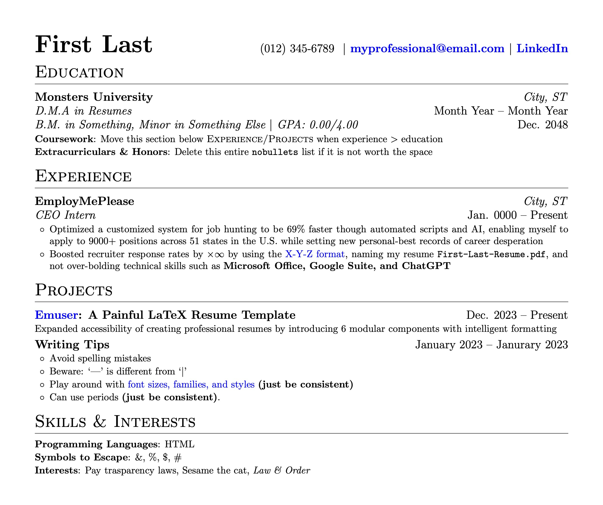
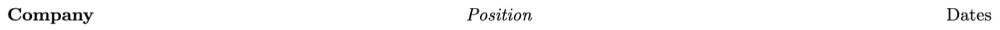

# emuser: a painless LaTeX resume template

> Yes, it's a play on Erewhon. Don't worry, this won't cost you a kidney (it's free!).

Clone this repoistory or open [this Overleaf template](plsmakelink)!


_Your resume could look like this! See [the PDF](out/emuser.pdf)._

# Get Started

You only need to edit [`emuser.tex`](emuser.tex). Only touch [`emuserutils.sty`](emuserutils.sty) if you're feeling dangerous.

### Main Header

For your name and contact information, `lrHeader` is a left-right table requiring 2 values. E.g.

```latex
\lrHeader
{First Last}
{(012) 345-6789 $\vert$ myprofessional@email.com}
```


### Section Lists

For organizing your education, experience, etc., `sectionList` is a title with items. E.g.

```latex
\begin{sectionList}{Title}
  \item \lr{Item 1}{}
  \item \lr{Item 2}{}
\end{sectionList}
```


## Section Items

For showing individual experiences, projects, etc., section items are usually **an `item` in a `sectionList`**.

### Headers

- `lr` is a left-right table, requiring 2-6 values via 2 `{}` and 0-4 `[]` (order matters). E.g.

  ```latex
  \lr{Project}{Dates}
  ```

  

  ```latex
  \lr{Company}{Location}  % Top-right value is italicized
  [Position][Dates]
  ```

  

  ```latex
  \lr{University}{}  % Omits location
  [Degree 2][Dates]
  [Degree 1][Dates]
  ```

  

- Alternatively, `lcr` is a left-center-right table, requring 3 values. E.g.
  ```latex
  \lcr{Company}{Position}{Dates}
  ```
  

### Lists

For detailing individual experiences, summarizing skills, etc.: `bullets` and `nobullets`.

- `bullets` take the default set by `setBulletStyle`. E.g.

  ```latex
  \setBulletStyle{$\sharp$}

  \begin{bullets}
      \item I'm a musician!
      \item These bullets are too fancy.
  \end{bullets}
  ```

  

- Reserve `nobullets` for single-line project details, single-item `sectionList`s, etc. E.g.

  ```latex
  \begin{sectionList}{Skills}
      \item \begin{nobullets}
          \item Skill issue
      \end{nobullets}
  \end{sectionList}
  ```

  

- `labeled` is usually **an `item` in a `nobullets`**, requiring 2 values. E.g.
  ```latex
  \labeled{Label}{Content}
  ```
  

## Spacing

LaTeX automatically handles most spacing, but there are two parameters for you to adjust so your resume fits one page:

- `setBulletsSpacing` affects items in `bullets` and `nobullets`
- `setSectionSpacing` affects titles and items in `sectionList`

If that's not enough, adjust the global font size via `documentclass` and margins via `geometry`.
